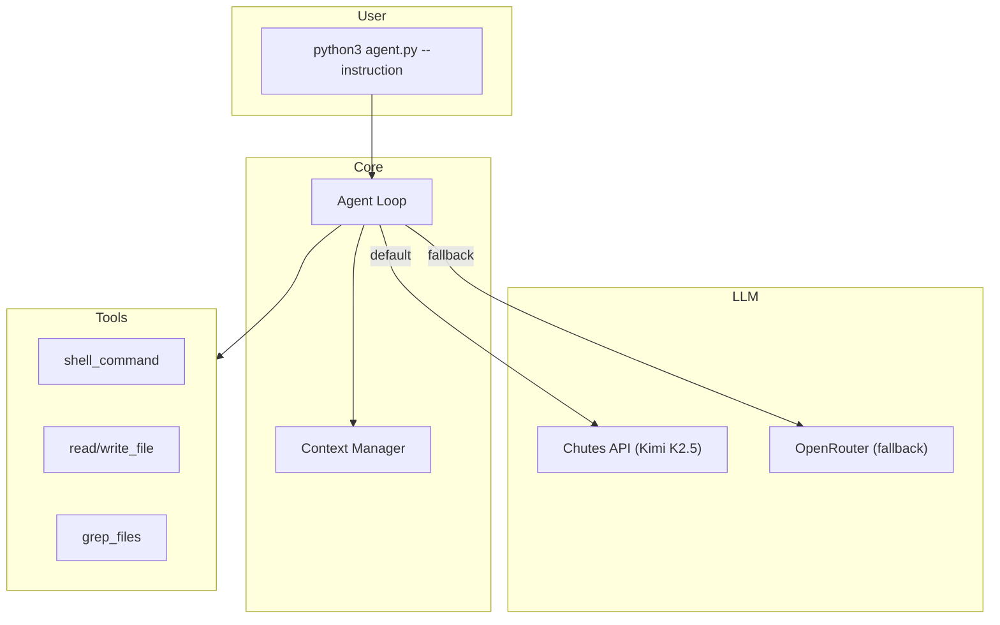

# BaseAgent - SDK 3.0

High-performance autonomous agent for [Term Challenge](https://term.challenge). Supports multiple LLM providers with **Chutes API** (Kimi K2.5-TEE) as the default.

## Quick Start

```bash
# 1. Install dependencies
pip install -r requirements.txt

# 2. Configure Chutes API (default provider)
export CHUTES_API_TOKEN="your-token-from-chutes.ai"

# 3. Run the agent
python3 agent.py --instruction "Your task description here..."
```

### Alternative: OpenRouter

```bash
export LLM_PROVIDER="openrouter"
export OPENROUTER_API_KEY="your-openrouter-key"
python3 agent.py --instruction "Your task description here..."
```

## Documentation

📚 **Full documentation available in [docs/](docs/)**

### Getting Started
- [Overview](docs/overview.md) - What is BaseAgent
- [Installation](docs/installation.md) - Setup instructions
- [Quick Start](docs/quickstart.md) - First task in 5 minutes

### Core Concepts
- [Architecture](docs/architecture.md) - Technical deep-dive with diagrams
- [Configuration](docs/configuration.md) - All settings explained
- [Usage Guide](docs/usage.md) - CLI commands and examples

### Reference
- [Tools Reference](docs/tools.md) - Available tools
- [Context Management](docs/context-management.md) - Token optimization
- [Best Practices](docs/best-practices.md) - Performance tips

### LLM Providers
- [Chutes Integration](docs/chutes-integration.md) - **Default provider setup**

## Architecture Overview



## Key Features

| Feature | Description |
|---------|-------------|
| **Fully Autonomous** | No user confirmation needed |
| **LLM-Driven** | All decisions made by the language model |
| **Chutes API** | Default: Kimi K2.5-TEE (256K context, thinking mode) |
| **Prompt Caching** | 90%+ cache hit rate |
| **Context Management** | Intelligent pruning and compaction |
| **Self-Verification** | Automatic validation before completion |

## Environment Variables

| Variable | Required | Default | Description |
|----------|----------|---------|-------------|
| `CHUTES_API_TOKEN` | Yes* | - | Chutes API token |
| `LLM_PROVIDER` | No | `chutes` | `chutes` or `openrouter` |
| `LLM_MODEL` | No | `moonshotai/Kimi-K2.5-TEE` | Model identifier |
| `LLM_COST_LIMIT` | No | `10.0` | Max cost in USD |
| `OPENROUTER_API_KEY` | For OpenRouter | - | OpenRouter API key |

*\*Required for default Chutes provider*

## Project Structure

```
baseagent/
├── agent.py                 # Entry point
├── src/
│   ├── core/
│   │   ├── loop.py          # Main agent loop
│   │   └── compaction.py    # Context management
│   ├── llm/
│   │   └── client.py        # LLM client
│   ├── config/
│   │   └── defaults.py      # Configuration
│   ├── tools/               # Tool implementations
│   └── prompts/             # System prompt
├── docs/                    # 📚 Full documentation
├── rules/                   # Development guidelines
└── astuces/                 # Implementation techniques
```

## Development Guidelines

For agent developers, see:
- [rules/](rules/) - Architecture patterns, best practices, anti-patterns
- [astuces/](astuces/) - Practical techniques (caching, verification, etc.)
- [AGENTS.md](AGENTS.md) - Comprehensive building guide

## License

MIT License - see [LICENSE](LICENSE).
