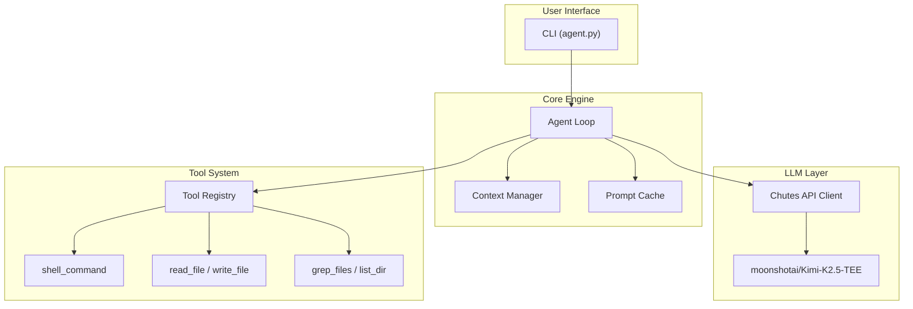
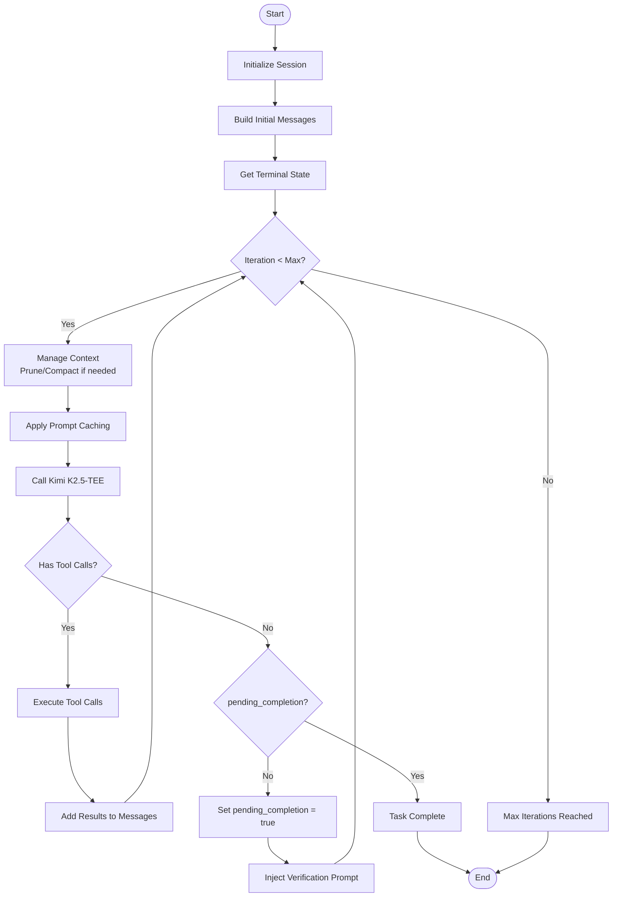
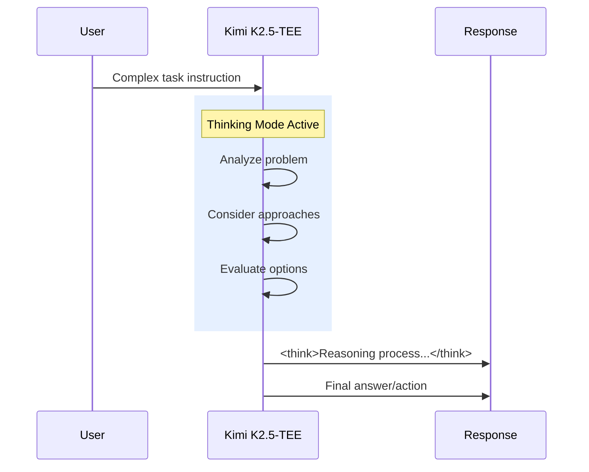
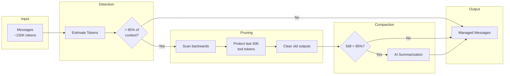

# BaseAgent - SDK 3.0

> **High-performance autonomous agent for [Term Challenge](https://term.challenge)**

Fully autonomous with **Chutes API** - powered by **moonshotai/Kimi-K2.5-TEE** (1T params, 32B activated, 256K context).

---

## Architecture at a Glance



---

## Key Features

- **Fully Autonomous** - No user confirmation required; makes decisions independently
- **LLM-Driven** - All decisions made by the language model, not hardcoded logic
- **Prompt Caching** - 90%+ cache hit rate for significant cost reduction
- **Context Management** - Intelligent pruning and compaction for long tasks
- **Self-Verification** - Automatic validation before task completion
- **Kimi K2.5-TEE** - 1T parameters, 256K context window, thinking mode enabled

---

## Installation

```bash
# Via pyproject.toml
pip install .

# Via requirements.txt
pip install -r requirements.txt
```

## Usage

```bash
export CHUTES_API_KEY="your-token"
python agent.py --instruction "Your task here..."
```

---

## Project Structure

```
baseagent/
├── agent.py                 # Entry point
├── src/
│   ├── core/
│   │   ├── loop.py          # Main agent loop
│   │   └── compaction.py    # Context management
│   ├── llm/
│   │   └── client.py        # LLM client (Chutes API)
│   ├── config/
│   │   └── defaults.py      # Configuration
│   ├── tools/               # Tool implementations
│   ├── prompts/
│   │   └── system.py        # System prompt
│   └── output/
│       └── jsonl.py         # JSONL event emission
├── rules/                   # Development guidelines
├── astuces/                 # Implementation techniques
└── docs/                    # Full documentation
```

---

## Agent Loop Workflow



---

## LLM Client (Chutes API)

```python
from src.llm.client import LLMClient

llm = LLMClient(
    model="moonshotai/Kimi-K2.5-TEE",
    temperature=1.0,  # Recommended for thinking mode
    max_tokens=16384,
)

response = llm.chat(messages, tools=tool_specs)
```

### Thinking Mode

Kimi K2.5-TEE supports thinking mode with `<think>...</think>` tags:



---

## Context Management



---

## Available Tools

| Tool | Description |
|------|-------------|
| `shell_command` | Execute shell commands |
| `read_file` | Read files with pagination |
| `write_file` | Create/overwrite files |
| `apply_patch` | Apply patches |
| `grep_files` | Search with ripgrep |
| `list_dir` | List directories |
| `view_image` | Analyze images |

---

## Configuration

```python
# src/config/defaults.py
CONFIG = {
    "model": "moonshotai/Kimi-K2.5-TEE",
    "provider": "chutes",
    "max_tokens": 16384,
    "temperature": 1.0,
    "max_iterations": 200,
    "auto_compact_threshold": 0.85,
    "prune_protect": 40_000,
    "cache_enabled": True,
}
```

| Variable | Description |
|----------|-------------|
| `CHUTES_API_KEY` | Chutes API key |
| `LLM_MODEL` | Model override (default: `moonshotai/Kimi-K2.5-TEE`) |

---

## Documentation

See [docs/](docs/) for comprehensive documentation:

- [Overview](docs/overview.md) - Design principles
- [Architecture](docs/architecture.md) - Technical deep-dive
- [Chutes Integration](docs/chutes-integration.md) - API setup
- [Tools Reference](docs/tools.md) - All tools documented
- [Context Management](docs/context-management.md) - Token optimization
- [Best Practices](docs/best-practices.md) - Performance tips

See [rules/](rules/) for development guidelines.

---

## License

MIT License - see [LICENSE](LICENSE).
