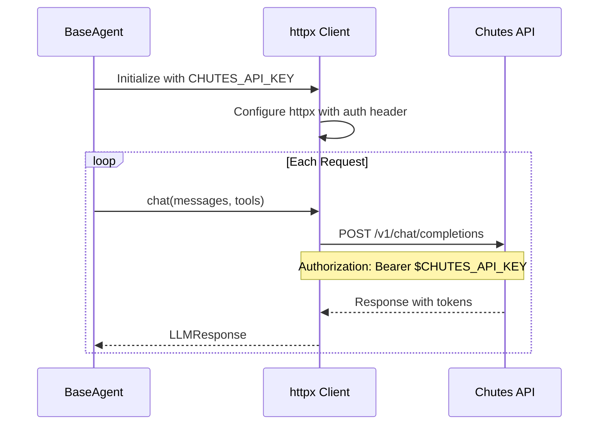
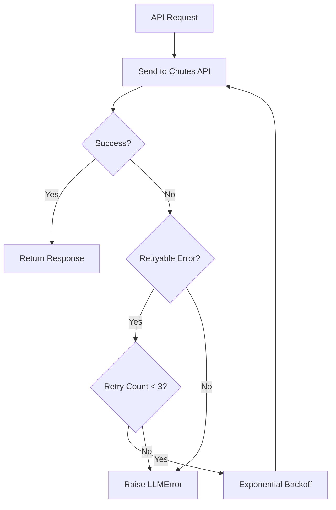

# Chutes API Integration

> **Using Chutes AI as your LLM provider for BaseAgent**

## Overview

[Chutes AI](https://chutes.ai) provides access to advanced language models through a simple OpenAI-compatible API. BaseAgent uses Chutes as its primary provider with a direct httpx-based client, supporting models like **DeepSeek Chat** and **Kimi K2.5-TEE**.

---

## Chutes API Features

| Feature | Value |
|---------|-------|
| **API Base URL** | `https://api.chutes.ai/v1` |
| **Default Model** | `deepseek/deepseek-chat` |
| **API Format** | OpenAI-compatible |
| **Context Window** | Model-dependent (up to 256K) |
| **Client** | Direct httpx (no external LLM library) |

---

## Quick Setup

### Step 1: Get Your API Key

1. Visit [chutes.ai](https://chutes.ai)
2. Create an account or sign in
3. Navigate to API settings
4. Generate an API key

### Step 2: Configure Environment

```bash
# Required: API key
export CHUTES_API_KEY="your-key-from-chutes.ai"

# Optional: Specify a different model
export LLM_MODEL="moonshotai/Kimi-K2.5-TEE"
```

### Step 3: Run BaseAgent

```bash
python3 agent.py --instruction "Your task description"
```

---

## Authentication Flow



---

## Supported Models

### DeepSeek Chat (Default)

The default model `deepseek/deepseek-chat` is well-suited for general coding tasks:

- Fast response times
- Cost-effective
- Good reasoning capabilities

### Kimi K2.5-TEE (Alternative)

The **moonshotai/Kimi-K2.5-TEE** model offers enhanced capabilities:

- **Total Parameters**: 1 Trillion (1T)
- **Activated Parameters**: 32 Billion (32B)
- **Architecture**: Mixture of Experts (MoE)
- **Context Length**: 256,000 tokens
- **Thinking Mode**: Shows reasoning process with `<think>` tags

### Temperature Settings

| Mode | Temperature | Top-p | Description |
|------|-------------|-------|-------------|
| **Deterministic** | 0.0 | - | Consistent, reproducible outputs |
| **Thinking** | 1.0 | 0.95 | More exploratory reasoning |
| **Instant** | 0.6 | 0.95 | Faster, balanced responses |

---

## Configuration Options

### Basic Configuration

```python
# src/config/defaults.py
CONFIG = {
    "model": os.environ.get("LLM_MODEL", "deepseek/deepseek-chat"),
    "provider": "chutes",
    "temperature": 0.0,  # Deterministic by default
    "max_tokens": 16384,
}
```

### Environment Variables

| Variable | Required | Default | Description |
|----------|----------|---------|-------------|
| `CHUTES_API_KEY` | Yes | - | API key from chutes.ai |
| `LLM_MODEL` | No | `deepseek/deepseek-chat` | Model identifier |
| `LLM_COST_LIMIT` | No | `10.0` | Max cost in USD |
| `CHUTES_BASE_URL` | No | `https://api.chutes.ai/v1` | API base URL |

---

## Thinking Mode Processing

When thinking mode is enabled, responses include `<think>` tags:

```xml
<think>
The user wants to create a file with specific content.
I should:
1. Check if the file already exists
2. Create the file with the requested content
3. Verify the file was created correctly
</think>

I'll create the file for you now.
```

BaseAgent can be configured to:
- **Parse and strip** the thinking tags (show only final answer)
- **Keep** the thinking content (useful for debugging)
- **Log** thinking to stderr while showing final answer

### Parsing Example

```python
import re

def parse_thinking(response_text: str) -> tuple[str, str]:
    """Extract thinking and final response."""
    think_pattern = r'<think>(.*?)</think>'
    match = re.search(think_pattern, response_text, re.DOTALL)
    
    if match:
        thinking = match.group(1).strip()
        final = re.sub(think_pattern, '', response_text, flags=re.DOTALL).strip()
        return thinking, final
    
    return "", response_text
```

---

## API Request Format

Chutes API follows OpenAI-compatible format:

```bash
curl -X POST https://api.chutes.ai/v1/chat/completions \
  -H "Authorization: Bearer $CHUTES_API_KEY" \
  -H "Content-Type: application/json" \
  -d '{
    "model": "deepseek/deepseek-chat",
    "messages": [
      {"role": "system", "content": "You are a helpful assistant."},
      {"role": "user", "content": "Hello!"}
    ],
    "max_tokens": 1024,
    "temperature": 0.0
  }'
```

---

## Error Handling and Retry

BaseAgent includes built-in retry logic for transient failures:



### Retryable Errors

- `rate_limit` (HTTP 429) - Automatic retry with backoff
- `server_error` (HTTP 5xx) - Automatic retry
- `timeout` - Automatic retry

---

## Cost Considerations

### Pricing (Approximate)

| Metric | Cost |
|--------|------|
| Input tokens | Varies by model |
| Output tokens | Varies by model |
| Cached input | Reduced rate |

### Cost Management

```bash
# Set cost limit
export LLM_COST_LIMIT="5.0"  # Max $5.00 per session
```

BaseAgent tracks costs and will abort if the limit is exceeded:

```python
# In src/llm/client.py
if self._total_cost >= self.cost_limit:
    raise CostLimitExceeded(
        f"Cost limit exceeded: ${self._total_cost:.4f}",
        used=self._total_cost,
        limit=self.cost_limit,
    )
```

---

## Troubleshooting

### Authentication Errors

```
LLMError: authentication_error
```

**Solution**: Verify your API key is correct and exported:

```bash
echo $CHUTES_API_KEY  # Should show your key
export CHUTES_API_KEY="correct-key"
```

### Rate Limiting

```
LLMError: rate_limit
```

**Solution**: BaseAgent automatically retries with exponential backoff. You can also:
- Wait a few minutes before retrying
- Reduce request frequency
- Check your API plan limits

### Model Not Found

```
LLMError: Model 'xyz' not found
```

**Solution**: Use the correct model identifier:

```bash
# Default model
export LLM_MODEL="deepseek/deepseek-chat"

# Or alternative model
export LLM_MODEL="moonshotai/Kimi-K2.5-TEE"
```

### Connection Timeouts

```
LLMError: timeout
```

**Solution**: BaseAgent retries automatically. If persistent:
- Check your internet connection
- Verify Chutes API status at [chutes.ai](https://chutes.ai)

---

## Implementation Details

BaseAgent uses a direct httpx-based client for Chutes API:

```python
# src/llm/client.py
import httpx

# Direct client with OpenAI-compatible format
client = httpx.Client(
    base_url="https://api.chutes.ai/v1",
    headers={
        "Authorization": f"Bearer {api_key}",
        "Content-Type": "application/json",
    },
)

# Make request
response = client.post("/chat/completions", json={
    "model": "deepseek/deepseek-chat",
    "messages": messages,
    "max_tokens": 16384,
})
```

This approach provides:
- No external LLM library dependencies
- Direct control over request/response handling
- Simplified error handling and retry logic

---

## Best Practices

### For Optimal Performance

1. **Choose the right model** - Use `deepseek/deepseek-chat` for speed, `moonshotai/Kimi-K2.5-TEE` for complex reasoning
2. **Use appropriate temperature** (0.0 for deterministic, higher for creative tasks)
3. **Leverage context windows** - Models support large context for codebases
4. **Monitor costs** with `LLM_COST_LIMIT`

### For Reliability

1. **Handle rate limits** gracefully (automatic in BaseAgent with retry logic)
2. **Log responses** for debugging complex tasks
3. **Set appropriate timeouts** for long-running operations

### For Cost Efficiency

1. **Use context management** to avoid token waste
2. **Set reasonable cost limits** for testing
3. **Choose cost-effective models** for simple tasks

---

## Next Steps

- [Configuration Reference](./configuration.md) - All settings explained
- [Best Practices](./best-practices.md) - Optimization tips
- [Usage Guide](./usage.md) - Command-line options
